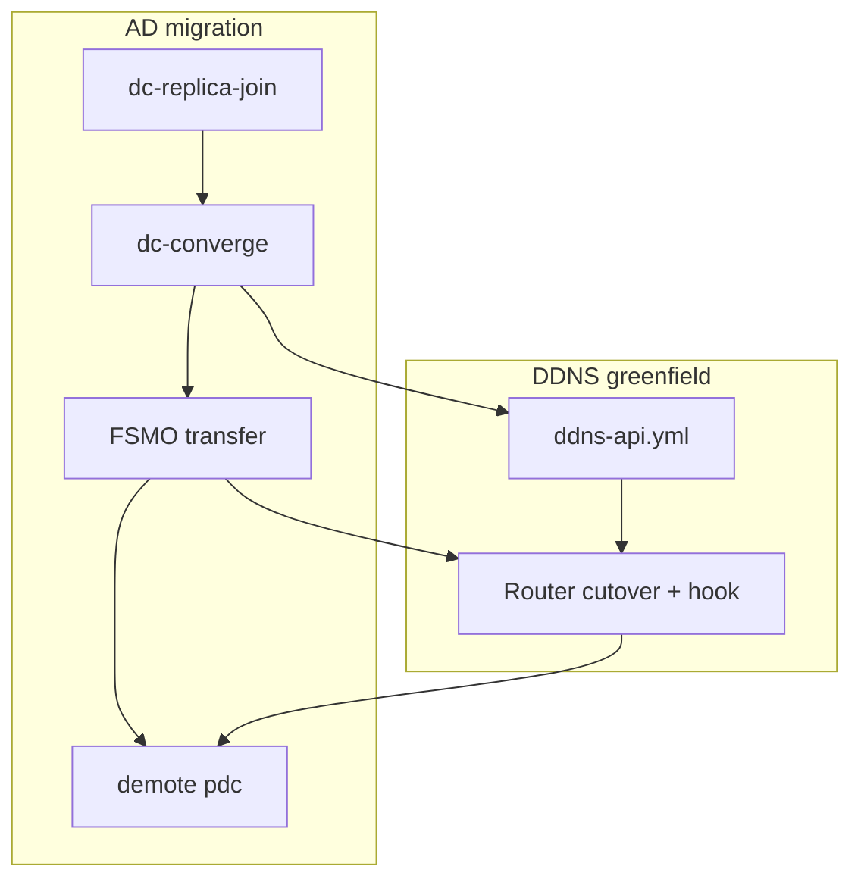

# DDNS runbook

Lease-driven dynamic DNS: dnsmasq `dhcp-script` → HTTP API on the DC → GSS-TSIG
`nsupdate` → BIND on the Samba AD DC.

This is **greenfield infrastructure** — deploying a new DDNS API and router hook.
It is not part of AD replication. Router cutover timing is documented in
[Router cutover timing](#router-cutover-timing) below.

See also:

- [dns-architecture.md](dns-architecture.md) — design and component map
- [unifi-gateway-dns.md](unifi-gateway-dns.md) — UCG Fiber router persistence and cutover
- [dc-runbook.md](dc-runbook.md) — replica join and DC converge

## Overview

| Piece | How | Ansible? |
|---|---|---|
| **DC prerequisites** | Reverse zone, `dnsupdater` account + keytab | `dc-converge.yml` |
| **DDNS API** | Docker container on DC `:8765` | `ddns-api.yml` |
| **Router hook** | `dhcp-ddns-hook.sh` + dnsmasq `dhcp-script` | Manual (UniFi: on-boot inject) |
| **Member clients** (optional) | Direct GSS-TSIG `nsupdate` from hosts | `ddns-client.yml` |

```
dnsmasq (router) --dhcp-script--> dhcp-ddns-hook.sh --HTTP POST-->
  ddns-nsupdate container on DC --GSS-TSIG nsupdate--> BIND on DC
```

## Prerequisites

- `dc-converge.yml` completed on the target DC — creates reverse zone and
  `dnsupdater` service account (`vault_dnsupdater_password`)
- `vault_ddns_shared_secret` set in inventory vault (bearer token for the API)
- Router: `curl` and `python3` or `jq` for the hook script

## Production deployment — DC

Deploy the DDNS API on **both** DCs so the router hook can fall back when dc1 (kvm01) is
unavailable:

```bash
PROD='./scripts/prod-run.sh --confirm-production --'

${PROD} playbooks/dc-converge.yml -e allow_production=true \
  --limit 'dc1.home.2123studios.com,dc2.home.2123studios.com'

${PROD} playbooks/ddns-api.yml -e allow_production=true \
  --limit 'dc1.home.2123studios.com,dc2.home.2123studios.com'
```

Single-DC deploy (legacy / first cutover):

```bash
${PROD} playbooks/dc-converge.yml -e allow_production=true \
  --limit dc1.home.2123studios.com

${PROD} playbooks/ddns-api.yml -e allow_production=true \
  --limit dc1.home.2123studios.com
```

**What Ansible configures (`ddns_nsupdate` role):**

- Docker Engine (`docker_engine` role)
- DDNS API at `http://<dc-ip>:8765` (HTTP + bearer token; TLS deferred)
- Container mounts DC keytab and `krb5.conf` (+ `krb5.conf.d`)
- Project at `/opt/ddns-nsupdate/`

**Verify from the control node or any host that can reach the DC:**

```bash
curl -fsS "http://192.168.1.10:8765/ddns/v1/health"
# Expected: ok
```

**Container logs** (`docker logs ddns-nsupdate` on the DC) include structured lease
lines on stderr, e.g.:

```text
lease outcome=ok peer=192.168.1.1 action=upsert ip_version=v4 address=192.168.1.19 hostname=calculon2 client_id=52:54:00:af:8e:0b
```

Successful lease POSTs omit the default HTTP access-log line to avoid duplication.
Bearer tokens and full JSON bodies are never logged.

`./scripts/migration/cutover-check.sh --phase pre --remote dc1.home.2123studios.com`
includes this health check when run after `ddns-api.yml`.

**Optional UFW on the DC:** set `ddns_nsupdate_manage_ufw: true` and
`ddns_nsupdate_ufw_allow_cidrs` to your LAN CIDRs in DC group vars.

**Retires:** legacy `dns-updater` account and any router-side DDNS hacks on pdc.

## Production deployment — router

Router configuration is **manual** — not Ansible-managed.

### Generic Linux router or DHCP server

1. Copy `scripts/dhcp-ddns-hook.sh` to `/usr/local/sbin/dhcp-ddns-hook.sh` (`chmod +x`)
2. Copy `scripts/lib/dhcp-ddns-parse.sh` to `/usr/local/lib/dhcp-ddns-parse.sh` (`chmod 644`)
3. Create `/etc/home-ddns.env` (mode `0600`, root-owned):

```sh
DDNS_UPDATE_URL="http://<dc-ip>:8765/ddns/v1/lease"
DDNS_BEARER_TOKEN="<same as vault_ddns_shared_secret>"
DDNS_DNS_DOMAIN="<your-domain>"
# Recommended when both DCs run the DDNS API (see Production deployment — DC):
DDNS_UPDATE_URL_FALLBACK="http://<replica-dc-ip>:8765/ddns/v1/lease"
```

3. Configure dnsmasq:

```conf
dhcp-script=/usr/local/sbin/dhcp-ddns-hook.sh
```

The hook always exits 0 (fail-open) so DHCP is never blocked by API failures.

### UniFi Cloud Gateway (UCG Fiber / UDM / UXG)

Production uses a **UniFi Cloud Gateway Fiber**. Do **not** rely on
`/usr/local/sbin` or `/etc/home-ddns.env` — use persistent `/data/home-ddns/`
and on-boot inject for `dhcp-script`.

See **[unifi-gateway-dns.md](unifi-gateway-dns.md)** and
[`scripts/router/unifi/`](../scripts/router/unifi/).

## Router cutover timing

DDNS deployment and DC authority shift meet at router cutover:



| Cutover step | DDNS action | Doc |
|---|---|---|
| DC converge | Creates `dnsupdater` (API prerequisite) | This runbook § Prerequisites |
| Pre-cutover gate | Run `ddns-api.yml`; verify API health | § Production deployment — DC |
| Router cutover | UniFi DHCP DNS → dc1; install router hook | [unifi-gateway-dns.md](unifi-gateway-dns.md) |

**Gate criteria before router cutover:**

- `ddns-api.yml` deployed; `curl http://<dc-ip>:8765/ddns/v1/health` returns `ok`
- FSMO on dc1
- `./scripts/migration/cutover-check.sh --phase pre` passes (includes API check)

- DHCP clients receive dc1 as DNS
- DDNS hook creates A/PTR after lease renew (`dig @dc1 <host>.<domain> A`)
- Legacy on-boot AD forwarding scripts removed from gateway

## Token rotation

1. Update `vault_ddns_shared_secret` in vault
2. Re-run `ddns-api.yml` on the DC
3. Update every router env file (`/etc/home-ddns.env` on generic Linux;
   `/data/home-ddns/home-ddns.env` on UniFi)

## API reference

- `GET /ddns/v1/health` — returns `200 ok`
- `POST /ddns/v1/lease` — JSON `{"action":"upsert"|"delete","address":"…","hostname":"label","client_id":"…"}`, header `Authorization: Bearer <secret>`

IPv4 upsert creates A + PTR. IPv4 delete removes PTR always; A is removed when
hostname is set or inferred from PTR. IPv6 upsert/delete manages AAAA only (no
ip6.arpa in this phase).

## Troubleshooting

### `invalid_address` with colon-hex `address` matching `client_id`

**Symptom** (DDNS API container logs):

```text
lease outcome=rejected ... ip_version=unknown address=00:04:b4:... detail=invalid_address
```

The `address` field looks like a long colon-separated hex string (a DHCPv6 DUID),
and often equals `client_id`. IPv4 leases in the same log window succeed normally.

**Cause:** An older `dhcp-ddns-hook.sh` used naive IPv6 detection (`*:*`) and
posted the DUID as the lease address instead of the real IPv6.

**Fix:**

1. Deploy current hook **and** parse library from the repo:
   - Generic: `scripts/dhcp-ddns-hook.sh` + `scripts/lib/dhcp-ddns-parse.sh`
   - UniFi: both files via `scripts/router/unifi/install-home-ddns.sh` (see
     [unifi-gateway-dns.md](unifi-gateway-dns.md))
2. Trigger a DHCPv6 renew on an affected host.
3. Confirm API log shows `ip_version=v6 outcome=ok` and `dig @<dc> <host> AAAA`
   returns the v6 address.

## Appendix — Lab

| Host | Role |
|---|---|
| `dc01.lab.test` | BIND DLZ, `dnsupdater` keytab, DDNS API (Docker) |
| `member01.lab.test` | Domain member, nsupdate client keytab (optional) |
| kvm01 (libvirt) | Lab dnsmasq + `dhcp-ddns-hook.sh` |

```bash
ansible-playbook playbooks/dc-converge.yml --limit dc01.lab.test
ansible-playbook playbooks/ddns-api.yml --limit dc01.lab.test
```

Lab hook setup: `scripts/lab/ddns-hook-ensure.sh`,
`scripts/lab/dhcp-ddns-hook-lab.sh`, `scripts/lab/libvirt/lab-network.xml.tmpl`.

**Integration test (dhcp-script → API → dig):**

```bash
INTEGRATION_SLICE=dhcp_ddns ./scripts/test-integration.sh
```

## Appendix — Member nsupdate clients (optional)

Hosts can update DNS directly via GSS-TSIG without the dhcp-script path.

```bash
ansible-playbook playbooks/ddns-client.yml --limit member01.lab.test
```

On a converged member:

```bash
kinit -kt /etc/krb5.keytab.dnsupdater dnsupdater@LAB.TEST
nsupdate -g <<'EOF'
server 192.168.100.10
zone lab.test
update add testhost.lab.test 300 A 192.168.100.99
send
EOF
dig @192.168.100.10 testhost.lab.test A +short
```

**Lab integration test:**

```bash
LAB_HOST=member01.lab.test ./scripts/test-integration.sh
```
