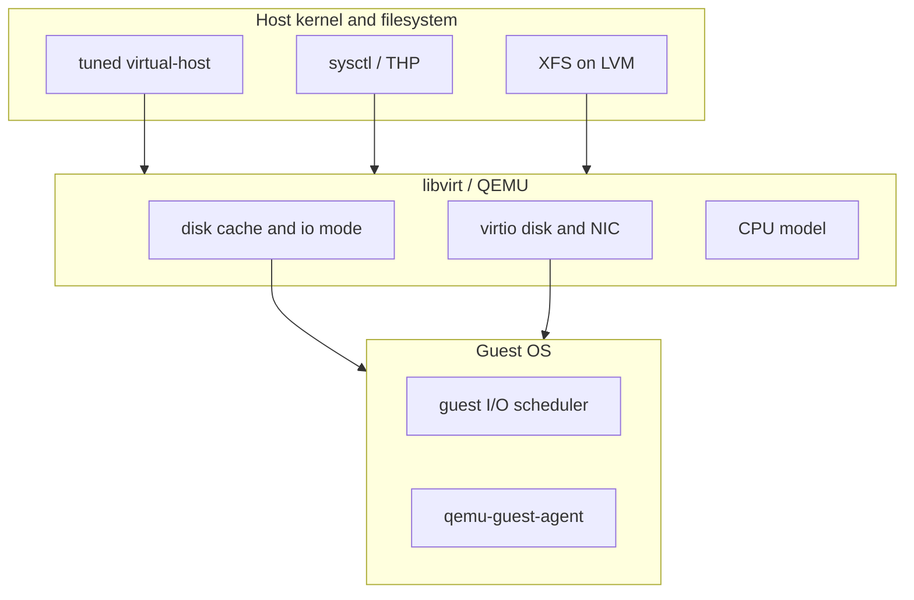

# Hypervisor performance (Ubuntu 24.04)

Learning guide and tuning reference for libvirt/KVM, Docker, and storage on hypervisor
hosts in this repo. See also [`hypervisor-runbook.md`](hypervisor-runbook.md) for
convergence and apply order.

## Mental model

Performance tuning spans three layers:



- **Host tuning** helps every VM and container on the hypervisor (scheduler, memory, THP).
- **VM create knobs** (virt-install / domain XML) control how each guest sees CPU, disk, and
  network — set at create time via [`scripts/vm/vm-create.sh`](../scripts/vm/vm-create.sh).
- **Storage path** in this repo is LVM → XFS → qcow2 dir pools. VM disks are **not** on NFS
  (see [`lab-storage.md`](lab-storage.md)). Shared data uses Kerberos NFS from kif.

Containers (Docker) share the host kernel. Host-level tuning is the main lever; isolate
Docker data on dedicated LVs (already done on kif/kvm01).

## Current repo defaults vs recommended

| Area | Before tuning | Recommended (this repo) | Where configured |
|---|---|---|---|
| Host profile | Ubuntu defaults | `tuned` `virtual-host` | `hypervisor_perf_tuning_enabled` |
| Swappiness | 60 (default) | 10 | sysctl via hypervisor role |
| THP | `always` (typical default) | `madvise` | systemd oneshot via hypervisor role |
| Libvirt/Docker XFS mounts | `defaults` | `defaults,noatime` on **new** LVs | `hypervisor_libvirt_data_volume_opts`, `docker_engine_data_volume_opts` |
| VM disk bus | virtio | virtio (unchanged) | `scripts/vm/vm-lib.sh` |
| VM disk cache/io | QEMU default (writeback) | `cache=none,io=native,discard=unmap` for prod-like VMs | `--perf-profile balanced\|storage` |
| VM CPU | QEMU default; passthrough only when nested | `host-model` for balanced/storage; passthrough when nested | `--perf-profile`, `vm_nested_virt` |
| VM NIC | virtio | virtio + multiqueue when vCPUs > 1 | `--perf-profile balanced\|storage` |
| NFS client | soft + Kerberos | optional `rsize`/`wsize` later (measure first) | `roles/nfs_client` — see below |
| Hugepages / CPU pin | none | opt-in per VM when needed | documented only (not automated) |

## Host tuning (Ansible)

Enable on a host or group:

```yaml
# group_vars/hypervisors/vars.yml or host_vars
hypervisor_perf_tuning_enabled: true
# When using dedicated LVs for libvirt/Docker (new mounts only):
hypervisor_libvirt_data_volume_opts: defaults,noatime
docker_engine_data_volume_opts: defaults,noatime
```

Lab hypervisors enable this by default in
[`inventories/lab/group_vars/hypervisors/vars.yml`](../inventories/lab/group_vars/hypervisors/vars.yml).

**Existing production LVs:** the role updates fstab opts but does **not** remount busy paths.
Apply `noatime` on a maintenance window:

```bash
sudo mount -o remount,noatime /var/lib/libvirt   # example path
```

### What each host knob does

| Knob | Effect | Risk |
|---|---|---|
| `virtual-host` | IRQ balancing, kernel params tuned for KVM | Low |
| `vm.swappiness=10` | Prefer keeping guest RAM in cache over swap | Low |
| THP `madvise` | Apps opt in to huge pages; avoids THP compaction spikes in mixed workloads | Low |
| XFS `noatime` | Skip atime updates on VM image trees | Low |

### Do not do yet (without measurement and topology map)

- **Static hugepages** — reserve RAM upfront; needs per-VM libvirt XML and AppArmor updates on 24.04
- **1 GB hugepages** — requires kernel boot params and reboot
- **vCPU pinning / NUMA binding** — host-specific; wrong pinning hurts more than defaults
- **VFIO GPU passthrough** — kvm01 uses NVIDIA via Docker, not passthrough
- **Production sysctl/disk profile changes** without lab `fio` baseline

## VM workload profiles

[`scripts/vm/vm-create.sh`](../scripts/vm/vm-create.sh) accepts `--perf-profile`:

| Profile | Use case | Disk | CPU | NIC |
|---|---|---|---|---|
| `lab` (default) | Nested lab, overlays, safe defaults | virtio, qcow2, default cache | default; passthrough if `--nested-virt` | virtio |
| `balanced` | Production-like general VMs | `cache=none,io=native,discard=unmap` | `host-model` (passthrough if nested) | virtio multiqueue if vCPUs > 1 |
| `storage` | Storage-heavy guests | same as balanced | same as balanced | same as balanced |
| `windows11` | Windows 11 desktop/server guests | same disk knobs; blank qcow2 (no cloud image) | `host-passthrough` + topology; full Hyper-V enlightenments; UEFI Secure Boot; TPM 2.0 | virtio multiqueue if vCPUs > 1 |

Examples:

```bash
# Lab nested hypervisor (unchanged behavior)
./scripts/vm/vm-create.sh -i lab hv01.lab.test --nested-virt

# Production DC with tuned disk path
./scripts/vm/vm-create.sh -i production --perf-profile balanced dc1.home.2123studios.com --disk-gb 20

# Windows 11: define optimized domain (no install ISO yet — attach manually)
./scripts/vm/vm-create.sh -i production --prepare calculon2.home.2123studios.com
```

Inventory vars for Windows (`windows` group):

| Variable | Purpose |
|---|---|
| `vm_perf_profile: windows11` | Select the Windows define path |
| `vm_os_variant: win11` | libosinfo / virt-install OS variant |
| `vm_cpu_count` / `vm_vcpus` | vCPU count |
| `vm_cpu_topology: "6,1"` | `cores,threads` (preferred over bare count when set) |
| `vm_memory_mb` / `vm_disk_gb` | RAM and blank disk size |

`windows11` skips Ubuntu cloud-init and defines only (unless `--force-boot`). Attach a Windows install ISO (and virtio-win drivers) before first boot.

**Why `cache=none`:** guest I/O bypasses the host page cache for that disk, which is correct
when the guest has its own buffer cache (typical for servers). **Why not in lab:** nested
overlays and shared backing files are simpler with QEMU defaults.

**Raw vs qcow2:** qcow2 overlays remain the default. Raw files can reduce metadata overhead
for fixed-size, I/O-heavy VMs but lose thin provisioning and complicate backup — migrate
individual VMs only after measurement.

## How to measure

### Quick host snapshot

```bash
./scripts/hypervisor/perf-baseline.sh
./scripts/hypervisor/perf-baseline.sh --output /tmp/hypervisor-baseline.txt
```

### Manual checks

```bash
# Virtualization stack
lsmod | grep -E 'kvm|vhost'
virsh -c qemu:///system list --all
virt-top   # live VM CPU/memory (installed by hypervisor role)

# Host tuning
tuned-adm active
sysctl vm.swappiness
cat /sys/kernel/mm/transparent_hugepage/enabled

# Topology (before any pinning experiments)
lscpu
numactl -H

# Block device scheduler (NVMe often uses 'none' by default on 24.04)
cat /sys/block/nvme0n1/queue/scheduler
```

### Disk throughput (compare before/after)

On the **host** (against the libvirt LV mount):

```bash
sudo fio --name=host-randread --filename=/var/lib/libvirt/images/home-network-v3/lab/vms/test.img \
  --size=1G --bs=4k --iodepth=32 --rw=randread --direct=1 --numjobs=1 --runtime=30 --group_reporting
```

Inside a **guest** (after creating a throwaway VM):

```bash
sudo apt install -y fio
sudo fio --name=guest-randread --filename=/var/lib/docker/testfile \
  --size=1G --bs=4k --iodepth=32 --rw=randread --direct=1 --runtime=30 --group_reporting
```

Run the same `fio` job before and after enabling host tuning or changing `--perf-profile`.
Compare `IOPS` and `lat (usec)` — aim for stable latency, not just peak IOPS.

### Suggested lab validation path

1. `./scripts/hypervisor/perf-baseline.sh` on hv01 before changes
2. Converge with `hypervisor_perf_tuning_enabled: true`
3. Create throwaway VM: `vm-create.sh --perf-profile balanced ...`
4. `fio` inside guest; re-run baseline script
5. Only then enable on kif/kvm01 via inventory + `./scripts/prod-run.sh`

## Storage and NFS follow-ups

These are **documented for later** — not automated in the first performance slice.

### NFS client (kvm01 and other members)

Current mounts use Kerberos (`sec=krb5i`) and soft failover opts in
[`roles/nfs_client/defaults/main.yml`](../roles/nfs_client/defaults/main.yml). Larger
`rsize`/`wsize` (e.g. 1048576) can improve sequential throughput but:

- Require compatible server export settings on kif
- Interact with `krb5i` integrity — measure, do not assume linear speedup
- Stay on `nfsvers=4.1` unless the whole stack is validated for 4.2

When ROADMAP NFS server automation lands (slice 15+), revisit server `nfsd` thread count
and export options together with client mount opts.

### kif block I/O (fileserver + hypervisor)

- **mdadm arrays:** [`roles/mdadm_monitor`](../roles/mdadm_monitor/) handles health/scrub, not scheduler tuning
- **NVMe vs HDD:** Ubuntu 24.04 typically uses `mq-deadline` or `none` for NVMe; rotational
  disks may benefit from `mq-deadline`. Check `/sys/block/*/queue/scheduler` before udev rules
- **Samba:** hand-maintained on kif until slice 19+; socket options and aio are out of scope here

### Docker on hypervisor

Host tuning + dedicated XFS LVs are the main wins. overlay2 remains appropriate. Avoid
overcommitting RAM when many containers and VMs share a host.

## References

- [`docs/hypervisor-runbook.md`](hypervisor-runbook.md) — role variables and apply order
- [`docs/lab-storage.md`](lab-storage.md) — VM disk layout
- [`docs/nfs-client-runbook.md`](nfs-client-runbook.md) — Kerberos mount behavior
- [`scripts/vm/vm-lib.sh`](../scripts/vm/vm-lib.sh) — virt-install argument builder
- [`roles/hypervisor/tasks/performance.yml`](../roles/hypervisor/tasks/performance.yml) — host tuning tasks
