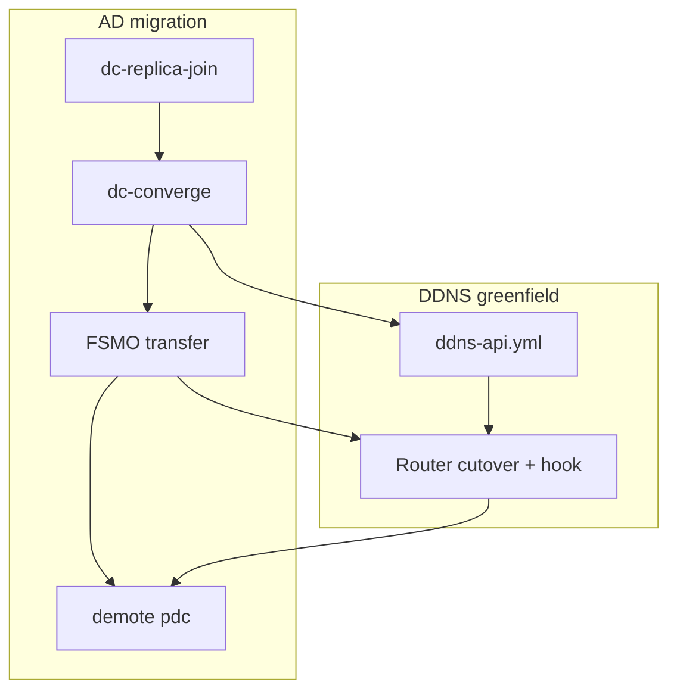

# AD migration runbook

Migrate an existing **Samba Active Directory** domain to the Ansible-managed
**dc1/dc2** architecture while preserving users, groups, computer SIDs, and
passwords.

**Preferred path:** join **dc1** as a **replica DC** to the live legacy server
(`pdc`) via DRS replication — `playbooks/dc-replica-join.yml`.

**Fallback path:** offline **`samba-tool domain backup` / `restore`** when the
legacy DC is unavailable — `playbooks/dc-restore.yml`.

**Domain:** `home.2123studios.com` (realm `HOME.2123STUDIOS.COM`, workgroup `HOME`)

**Do not run migration playbooks against production until your maintenance window.**
Use `./scripts/migration/preflight-check.sh` from the control node beforehand.

See also:

- [production-runbook.md](production-runbook.md) — wrapper and apply order
- [dc-runbook.md](dc-runbook.md) — bootstrap vs replica join vs restore vs converge
- [run-order.md](run-order.md) — migration apply order
- [ddns-runbook.md](ddns-runbook.md) — DDNS API + router hook (greenfield; gates in Phase 1)
- [unifi-gateway-dns.md](unifi-gateway-dns.md) — UCG Fiber router cutover mechanics
- [vault-schema.md](vault-schema.md) — production secrets

## Host roles in this migration

| Host | IP (example) | Treatment |
|---|---|---|
| **dc1** | `192.168.1.10` | Replica join to live pdc; becomes primary after FSMO transfer |
| **dc2** | (Phase 2) | Additional replica — same join playbook |
| **pdc** (old) | `192.168.1.2` | Stays online until dc1 validated; demote after cutover. Also runs **internal→external mail relay** (see [Non-AD services on pdc](#non-ad-services-on-pdc-decommission-blockers)) |
| **kvm01** | `192.168.1.21` | CentOS — manual DNS only (deferred) |
| **kif** | `192.168.1.152` | CentOS — manual DNS only (deferred) |
| **bastion** | TBD | Reprovision Ubuntu 24.04 → `baseline` + `domain-join` |
| Windows devices | few | Manual DNS to dc1 |

Production DC naming: **`dc1`**, **`dc2`**, … (`dc1.home.2123studios.com`). Retire
`pdc` / `sdc` hostnames after demotion.

---

## DNS and DDNS during migration

This runbook covers **AD migration** (replica join, FSMO, demote). Two related
workstreams run in the same maintenance window but are documented elsewhere:

| Workstream | What | Runbook |
|---|---|---|
| **AD migration** | Replica join, FSMO, demote pdc, reprovision members | This document |
| **DDNS greenfield** | New DDNS API on dc1 + router `dhcp-script` hook | [ddns-runbook.md](ddns-runbook.md) |
| **DNS authority shift** | Clients query dc1; retire router AD forwarding | [unifi-gateway-dns.md](unifi-gateway-dns.md) |



Phase 1 Steps 3 and 6 are **gates** — short checkpoints that link to the DDNS and
router runbooks. Do not demote pdc until both gates pass.

---

## Pre-flight checklist

Run from the Ansible control node before the maintenance window:

```bash
./scripts/migration/preflight-check.sh
```

Manual checks:

1. **Samba version (pre-join only)** — on old pdc and dc1, run `samba -V`. Before
   replica join or offline restore, Ubuntu 24.04 Samba must be **≥** Fedora pdc version
   or join/restore may fail. After a successful join, mixed versions are fine — see
   [Samba version skew](#samba-version-skew-dc1-vs-pdc) and `repl-check.sh`.
2. **Production inventory** — copy templates, fill real IPs/hostnames, create vault.
3. **SSH** — copy `group_vars/all/ansible.yml.example` → `ansible.yml` (user
   `ansible`, key `scripts/vm/keys/prod_id_ed25519`); verify with preflight or
   `ssh -i scripts/vm/keys/prod_id_ed25519 ansible@192.168.1.10`.
4. **Old pdc stays running** until dc1 is validated and FSMO are transferred (rollback
   depends on this).
5. **Join connectivity** — dc1 must reach pdc on LDAP/Kerberos/DNS (TCP/UDP 53, 88,
   389, 445, etc.). During join, dc1 uses pdc as its resolver.
6. **kvm01 VM storage** — on kvm01, ensure libvirt network `external-default` is
   active, then run once: `./scripts/vm/keys-ensure.sh -i production` and
   `sudo ./scripts/vm/dirs-ensure.sh -i production` (see [lab-storage.md](lab-storage.md)).

Set in production `group_vars/dc/vars.yml`:

```yaml
samba_dc_migration_host: true
samba_dc_migration_mode: replica
samba_dc_target_server_name: dc1
samba_dc_join_server: pdc.home.2123studios.com
samba_dc_join_nameservers:
  - 192.168.1.2
samba_dc_join_site: FerryCrossing
```

This blocks accidental `dc-bootstrap.yml` on the migration host.

Optional: take an offline backup on pdc before the window (recommended safety net —
not required for replica join). See [Appendix — offline backup](#appendix--offline-backup).

### Samba version skew (dc1 vs pdc)

Ubuntu 24.04 ships **Samba 4.19.x** from apt; Fedora pdc may run a newer release (e.g.
4.21.x). Upstream stable (4.22+) is ahead of both — that gap is normal for LTS distros
with security backports, not a sign of an unpatched install.

| Phase | Version rule |
|---|---|
| **Before replica join / offline restore** | dc1 Samba should be **≥** pdc Samba (`samba -V` on both). Older join/restore targets may fail against a newer source. |
| **After successful replica join** | Mixed versions (e.g. 4.19 ↔ 4.21) are **acceptable** while pdc stays online. Monitor replication; do not chase third-party packages or source builds unless join is blocked or you need a specific 4.20+ feature. |
| **After pdc demotion** | All DCs are **Ubuntu LTS** hosts using distro `samba-ad-dc` (no Fedora, no third-party Samba builds). dc1 and any new replicas (dc2, remote-site DCs) run whatever Samba version ships with the Ubuntu LTS release in use at provision time. Keep versions aligned via `apt upgrade`; before joining a new DC, its Samba should be **≥** the DC it replicates from (`samba -V`). |

While pdc is online, run replication checks from the control node:

```bash
./scripts/migration/repl-check.sh --remote dc1.home.2123studios.com
```

Known 4.19 limitation: `dns hostname =` in smb.conf is **4.20+** only (harmless warning).
Ansible removes it in `dns_bind_dlz.yml`; see Step 4 below.

**Platform policy (post-pdc):** pdc is the last non-Ubuntu DC. After demotion, provision
every additional domain controller on **Ubuntu LTS** (Noble 24.04 today; future DCs use
whatever LTS is current when built) with `dc-replica-join.yml` against dc1 or a peer DC.
Do not add Fedora or source-built Samba DCs to the domain.

---

## Phase 0 — Prepare pdc (manual, on legacy DC)

Replica join talks to **live** pdc over LDAP/DNS. Fix these on **pdc** before
running `dc-replica-join.yml` on dc1.

### DNS records for pdc

Join uses `samba_dc_join_server` (hostname). Stale or wrong DNS records cause long
timeouts and `NT_STATUS_CONNECTION_DISCONNECTED`.

On **pdc** (or any host using pdc DNS):

```bash
dig +short pdc.home.2123studios.com A
dig +short pdc.home.2123studios.com AAAA
```

- **A** must be `192.168.1.2` only.
- Remove stale **AAAA** records (old ISP IPv6, wrong addresses). Samba clients often
  prefer AAAA and hang or fail LDAP when the address is unreachable.

```bash
sudo samba-tool dns query 127.0.0.1 home.2123studios.com pdc ALL -UAdministrator
# Delete each bad AAAA (repeat per stale address):
sudo samba-tool dns delete 127.0.0.1 home.2123studios.com pdc AAAA <stale-ipv6> -UAdministrator
```

From **dc1**, confirm only the expected A record remains:

```bash
dig +short pdc.home.2123studios.com AAAA   # should be empty
dig +short pdc.home.2123studios.com A      # 192.168.1.2
```

### AD Sites and Services (required for DC join)

`domain join … DC` registers the new host under
`CN=<hostname>,CN=Servers,CN=<site>,CN=Sites,CN=Configuration,…`. If
**`CN=Servers`** is missing under the join site, join fails with
`LDAP_NO_SUCH_OBJECT … parent does not exist`.

This domain uses three AD sites — see **[ad-sites.md](ad-sites.md)** for the full
reference:

| Site | Subnet |
|---|---|
| **FerryCrossing** | `192.168.1.0/24` (dc1 joins here) |
| **Woodbine** | `192.168.33.0/24` |
| **Swanhollow** | `192.168.65.0/24` |

On **pdc**, create sites and subnets (safe to run before dc1 exists). **Site links are
not required** for the dc1 join — only `CN=Servers,CN=FerryCrossing,…` must exist
(see verify step below). Defer inter-site links until you add DCs at Woodbine or
Swanhollow ([ad-sites.md](ad-sites.md) §5).

```bash
sudo samba-tool sites create FerryCrossing
sudo samba-tool sites create Woodbine
sudo samba-tool sites create Swanhollow

# Move main LAN off Default-First-Site-Name if needed:
sudo samba-tool sites subnet list
sudo samba-tool sites subnet delete 192.168.1.0/24   # only if mapped to Default-First-Site-Name

sudo samba-tool sites subnet add 192.168.1.0/24 FerryCrossing
sudo samba-tool sites subnet add 192.168.33.0/24 Woodbine
sudo samba-tool sites subnet add 192.168.65.0/24 Swanhollow

sudo samba-tool drs kcc
sudo samba-tool dbcheck --cross-ncs --fix
```

Verify the dc1 join target:

```bash
sudo ldbsearch -H /var/lib/samba/private/sam.ldb \
  -b "CN=Servers,CN=FerryCrossing,CN=Sites,CN=Configuration,DC=home,DC=2123studios,DC=com" \
  -s base dn
```

Set in `group_vars/dc/vars.yml` (playbook passes `--site=` automatically):

```yaml
samba_dc_join_site: FerryCrossing
```

### Clean up after a failed join attempt

`DC1$` is a **domain controller** account (`OU=Domain Controllers`), not a workstation.
`samba-tool computer delete` will always fail with *Computer is not a workstation*.

**1. On dc1** — stop services and take the host offline from AD’s perspective:

```bash
sudo systemctl stop named samba-ad-dc
```

Local `samba-tool domain demote` on dc1 often **does not fully clean AD** when replication
was never healthy. Use pdc to remove the dead server (step 2).

**2. On pdc** — remove all AD references to the dead replica (run while dc1 is stopped):

```bash
sudo samba-tool computer list | grep -i dc1
sudo samba-tool domain demote --remove-other-dead-server=DC1 -UAdministrator
```

Use the **NetBIOS name** (`DC1`), not `DC1$`. If that fails, try the hostname or NTDS
object GUID from `samba-tool drs showrepl` on pdc.

Verify removal:

```bash
sudo samba-tool computer list | grep -i dc1          # should be empty
sudo ldbsearch -H /var/lib/samba/private/sam.ldb \
  -b "CN=Servers,CN=FerryCrossing,CN=Sites,CN=Configuration,DC=home,DC=2123studios,DC=com" \
  -s onelevel "(objectClass=server)" cn
# CN=DC1 should be gone; CN=PDC remains
```

Clean stale DNS for dc1 on pdc if demote left records (`samba-tool dns query/delete` or
RSAT). Then audit pdc (sites, GUID `_msdcs` CNAMEs, zone NS glue) before rejoin.

### PDC audit (automated)

From the **control node** (SSH to pdc as `ansible`, sudo on pdc):

```bash
AD_ADMIN_PASSWORD='…' ./scripts/migration/pdc-audit.sh --remote pdc.home.2123studios.com
```

Or **on pdc** directly:

```bash
sudo AD_ADMIN_PASSWORD='…' /path/to/pdc-audit.sh --on-pdc
```

The script is read-only unless you pass `--apply-fixes` (runs `drs kcc` and
`dbcheck --cross-ncs --fix`). Fix any **FAIL** lines before rejoin — especially:

- stale **DC1** computer account (run demote step above first)
- missing **pdc** GUID CNAME under `_msdcs.home.2123studios.com`
- zones with no apex **NS** record (BIND on dc1 will reject them)
- **drs showrepl** errors (`WERR_FILE_NOT_FOUND`, etc.)

Manual fixes the script points at but does not auto-apply. **Always use `127.0.0.1`**
as the DNS server target on pdc — not `localhost` or `pdc.home.2123studios.com`
(see [PDC machine account and IPv6](#pdc-machine-account-and-ipv6) below).

```bash
# pdc DSA GUID CNAME (use GUID from audit output or ldbsearch)
sudo samba-tool dns add 127.0.0.1 _msdcs.home.2123studios.com \
  <pdc-object-guid> CNAME pdc.home.2123studios.com. -UAdministrator

# Apex NS per zone missing @ NS (repeat per zone from audit WARN lines)
sudo samba-tool dns add 127.0.0.1 <zone> @ NS pdc.home.2123studios.com. -UAdministrator

# Stale pdc AAAA
sudo samba-tool dns delete 127.0.0.1 home.2123studios.com pdc AAAA <stale-ipv6> -UAdministrator

# Bulk DNS fix helper (Administrator, 127.0.0.1 only):
AD_ADMIN_PASSWORD='…' ./scripts/migration/pdc-dns-fix.sh --remote pdc.home.2123studios.com

# After machine account is repaired (below), re-register DNS:
sudo samba_dnsupdate --verbose

# After manual DNS/AD fixes
sudo samba-tool drs kcc -UAdministrator
sudo samba-tool dbcheck --cross-ncs --fix -UAdministrator
sudo samba-tool drs showrepl -UAdministrator   # expect no WERR_* / failed inbound
```

Re-run the audit until **0 failure(s)** before Phase 1.

### PDC machine account and IPv6

If `samba_dnsupdate` or `samba-tool … --machine-pass` fail with:

```text
kinit for PDC$@HOME.2123STUDIOS.COM failed (Preauthentication failed)
Failed to bind … ncacn_ip_tcp:2600:… NT_STATUS_LOGON_FAILURE
```

you usually have **two** problems at once:

1. **Machine password desync** — `secrets.tdb` no longer matches the `PDC$` account in
   AD. `net ads testjoin -P` reports `LDAP_INVALID_CREDENTIALS`. Manual
   `kinit -k -t /var/lib/samba/private/secrets.keytab PDC$@…` may still succeed
   (keytab KVNO matches AD) while `--machine-pass` does not.
2. **Stale IPv6** — pdc has ISP addresses (`2600:…`) and AD DNS has **AAAA** records
   for `pdc`. Samba tools prefer IPv6 for RPC; logon fails even on `127.0.0.1` DNS RPC
   until the machine account is fixed.

**Do not rely on `samba_dnsupdate` until both are fixed.** Use **Administrator** and
**`127.0.0.1`** for DNS edits (`pdc-dns-fix.sh` or manual `samba-tool dns`).

#### Step A — confirm on pdc

```bash
dig +short @127.0.0.1 pdc.home.2123studios.com AAAA    # should be empty
sudo net ads testjoin -P                                 # expect INVALID_CREDENTIALS if broken
sudo kinit -k -t /var/lib/samba/private/secrets.keytab 'PDC$@HOME.2123STUDIOS.COM' && klist
sudo samba-tool dns zonelist 127.0.0.1 --machine-pass    # fails until Step C
```

#### Step B — remove IPv6 from AD DNS (Administrator)

```bash
# List current records
sudo samba-tool dns query 127.0.0.1 home.2123studios.com pdc ALL -UAdministrator

# Delete each AAAA (repeat per address)
sudo samba-tool dns delete 127.0.0.1 home.2123studios.com pdc AAAA <ipv6> -UAdministrator

dig +short @127.0.0.1 pdc.home.2123studios.com AAAA   # must be empty
```

Optional but recommended before rejoin — stop Samba from using WAN IPv6 for DC traffic
(edit `/etc/samba/smb.conf`, then `sudo systemctl restart samba`):

```ini
interfaces = 192.168.1.2/24 127.0.0.0/8
bind interfaces only = yes
```

#### Step C — resync local machine secrets (do **not** use `user setpassword PDC$`)

`--machine-pass`, `samba_dnsupdate`, and `net ads testjoin` read the password from
**`secrets.ldb`** (`flatname=HOME,cn=Primary Domains`), **not** from the keytab and
**not** directly from the `PDC$` object you see in `sam.ldb`.

**Do not run** `samba-tool user setpassword 'PDC$'` — it updates AD (`sam.ldb`) but
leaves `secrets.ldb` stale (often KVNO 1 from provision time). That makes Kerberos
worse: keytab export may work while `--machine-pass` still fails.

Check the desync:

```bash
# AD account (sam.ldb) — e.g. KVNO 3
sudo ldbsearch -H /var/lib/samba/private/sam.ldb \
  -b 'CN=PDC,OU=Domain Controllers,DC=home,DC=2123studios,DC=com' \
  msDS-KeyVersionNumber

# Local trust store (secrets.ldb) — if KVNO is lower, secrets are stale
sudo ldbsearch -H /var/lib/samba/private/secrets.ldb \
  -b 'flatname=HOME,cn=Primary Domains' msDS-KeyVersionNumber whenChanged
```

**If you already ran `user setpassword 'PDC$'`** — sync `secrets.ldb` from `sam.ldb`
(Samba upstream `chgtdcpass`):

```bash
sudo ./scripts/migration/pdc-sync-machine-secrets.sh --on-pdc
# or from control node: ./scripts/migration/pdc-sync-machine-secrets.sh --remote pdc…
```

**If secrets were never manually changed** — rotate the trust password the supported way
(updates AD **and** `secrets.ldb` together):

```bash
sudo net ads changetrustpw -S 127.0.0.1 -UAdministrator
```

Then refresh keytabs (remove old files first — `exportkeytab` refuses to overwrite):

```bash
sudo rm -f /var/lib/samba/private/secrets.keytab /etc/krb5.keytab
sudo samba-tool domain exportkeytab /var/lib/samba/private/secrets.keytab
sudo samba-tool domain exportkeytab /etc/krb5.keytab
sudo systemctl restart samba

sudo net ads testjoin -P
sudo samba-tool dns zonelist 127.0.0.1 --machine-pass
```

`testjoin` → `Join is OK` and `dns zonelist --machine-pass` must succeed before
`samba_dnsupdate`.

#### Step D — remaining DNS records

```bash
AD_ADMIN_PASSWORD='…' ./scripts/migration/pdc-dns-fix.sh --on-pdc
# or --remote from control node

sudo samba_dnsupdate --verbose
sudo samba-tool drs kcc -UAdministrator
sudo samba-tool drs showrepl -UAdministrator
```

**3. On dc1** — wipe local state before a fresh join:

```bash
sudo systemctl stop named samba-ad-dc
sudo rm -rf /var/lib/samba
sudo rm -f /etc/samba/smb.conf
```

Do **not** power dc1 back up with the old `/var/lib/samba` after
`--remove-other-dead-server` — see [Samba wiki — demote dead DC](https://wiki.samba.org/index.php/Demote_a_Samba_DC).

---

## Phase 1 — Replica join and converge dc1

Production wrapper:

```bash
PROD='./scripts/prod-run.sh --confirm-production --'
```

| Step | Action |
|---|---|
| 1 | Join dc1 as replica DC |
| 2 | Converge DC (BIND, dnsupdater, chrony) |
| 3 | **Gate:** Deploy DDNS API → [ddns-runbook.md](ddns-runbook.md) |
| 4 | Verify AD and DNS locally on dc1 |
| 5 | Transfer FSMO roles to dc1 |
| 6 | **Gate:** DNS/DDNS router cutover → [unifi-gateway-dns.md](unifi-gateway-dns.md) |
| 7 | Manual DNS on CentOS hosts |
| 8 | Demote old pdc |

### Provision dc1 VM (new Ubuntu guest on kvm01)

If dc1 is not already running, create it on kvm01 against libvirt network
`external-default` (static IP from inventory):

```bash
./scripts/vm/vm-create.sh -i production dc1.home.2123studios.com
./scripts/vm/wait-ssh.sh -i production dc1.home.2123studios.com
```

Host must have `vm_name`, `vm_ip`, and network defaults in production inventory
(see `hosts.yml.example` and [production-runbook.md](production-runbook.md)).

Destroy and recreate dc1 if a prior partial restore left `/var/lib/samba` in a
bad state — replica join requires a **fresh** host (no `sam.ldb`).

### Step 1 — Replica join

```bash
${PROD} playbooks/dc-replica-join.yml -e allow_production=true \
  --limit dc1.home.2123studios.com
```

The playbook:

- Sets upstream DNS to **pdc** (`samba_dc_join_nameservers`) before package installs
- Installs Samba AD DC + BIND packages on a fresh Ubuntu host
- Runs `samba-tool domain join home.2123studios.com DC --server=pdc ... --dns-backend=BIND9_DLZ`
- Replicates the full domain database (users, groups, computers, DNS zones, SIDs)
- Wires BIND9_DLZ, AppArmor, and starts `named` + `samba-ad-dc`

**If apt fails with "Failed to update apt cache"**, dc1 cannot reach pdc DNS or the
internet. Fix routing/firewall or break-glass resolvers on dc1:

```bash
sudo tee /etc/resolv.conf <<'EOF'
nameserver 192.168.1.2
search home.2123studios.com
EOF
```

**If join fails with `LDAP_NO_SUCH_OBJECT` / `parent does not exist` under
`CN=Servers,CN=FerryCrossing`**, finish AD site setup on pdc —
[Phase 0 — AD Sites](#ad-sites-and-services-required-for-dc-join) and [ad-sites.md](ad-sites.md).

**If join fails with authentication errors**, confirm `vault_ad_join_user` /
`vault_ad_join_password` in `group_vars/all/vault.yml` and that the account has
Domain Admin rights.

**If join succeeded but BIND failed**, check `journalctl -u named -b` for
`has no NS records` / `bad zone`. BIND9_DLZ is stricter than Samba internal DNS:
every zone needs an apex **NS** record. Replica join often creates an auto
**ip6.arpa** reverse zone from the host's IPv6 addresses with SOA only — easy to
miss when fixing other zones.

**You do not need to remove dc1 or rejoin.** `samba-ad-dc` is fine; only BIND glue
is broken. On **dc1** (not only pdc), add NS to the zone named in the journal, then
verify it landed before restarting `named`:

```bash
# Add NS on dc1 — --machine-pass works as root without typing Administrator password:
sudo samba-tool dns add localhost \
  7.6.f.3.0.0.1.8.6.4.6.0.1.0.6.2.ip6.arpa @ NS dc1.home.2123studios.com. \
  --machine-pass

# Verify apex has more than SOA (expect 2+ dnsRecord lines after NS is added):
sudo ldbsearch -H /var/lib/samba/private/sam.ldb \
  -b "DC=@,DC=7.6.f.3.0.0.1.8.6.4.6.0.1.0.6.2.ip6.arpa,CN=MicrosoftDNS,DC=DomainDnsZones,DC=home,DC=2123studios,DC=com" \
  dnsRecord | grep -c dnsRecord

sudo systemctl reset-failed named
sudo systemctl start named
```

**Alternative** — delete the auto ip6 reverse zone if you do not need IPv6 PTR
(this repo's DDNS phase does not use ip6.arpa):

```bash
sudo samba-tool dns zonedelete localhost \
  7.6.f.3.0.0.1.8.6.4.6.0.1.0.6.2.ip6.arpa --machine-pass
```

Or fix all zones missing apex NS on dc1:

```bash
list=$(sudo samba-tool dns zonelist localhost --machine-pass)
while read -r zone; do
  [[ -z "$zone" ]] && continue
  sudo samba-tool dns query localhost "$zone" @ NS --machine-pass 2>/dev/null | grep -q 'NS:' && continue
  sudo samba-tool dns add localhost "$zone" @ NS dc1.home.2123studios.com. --machine-pass --allow-existing
done < <(printf '%s\n' "$list" | awk -F': ' '/pszZoneName/ {print $2}')
sudo systemctl reset-failed named && sudo systemctl start named
```

`dig @127.0.0.1 … NS` may still return empty on Samba AD — that is normal. BIND only
needs the NS present in the directory partition, not visible via recursive `dig`.

Re-run DNS wiring after a manual fix:

```bash
${PROD} playbooks/dc-replica-join.yml -e allow_production=true \
  --tags samba_dns --skip-tags baseline \
  --limit dc1.home.2123studios.com
```

### Step 2 — Converge

```bash
${PROD} playbooks/dc-converge.yml -e allow_production=true \
  --limit dc1.home.2123studios.com
```

Creates reverse zone (if missing), `dnsupdater` service account, MS-SNTP chrony settings.

### Step 3 — Gate: DDNS API deployed

**Greenfield** — not part of AD replication. Deploy after Step 2 converge (which
creates the `dnsupdater` account the API needs). Replaces legacy `dns-updater` on pdc.

Full procedure: **[ddns-runbook.md](ddns-runbook.md) § Production deployment — DC**

```bash
${PROD} playbooks/ddns-api.yml -e allow_production=true \
  --limit dc1.home.2123studios.com
```

**Pass when:** API health check succeeds:

```bash
curl -fsS http://192.168.1.10:8765/ddns/v1/health   # → ok
```

`cutover-check.sh --phase pre` (Step 4) includes this check automatically.

### Step 4 — Verify on dc1

From the control node (automated):

```bash
./scripts/migration/repl-check.sh --remote dc1.home.2123studios.com
./scripts/migration/cutover-check.sh --phase pre --remote dc1.home.2123studios.com
```

Manual checks on dc1:

```bash
sudo samba-tool domain info 127.0.0.1
sudo samba-tool drs showrepl
sudo samba-tool user list | head
sudo samba-tool fsmo show
dig @127.0.0.1 home.2123studios.com SOA +short
dig @127.0.0.1 -x 192.168.1.10 +short
dig @127.0.0.1 _ldap._tcp.home.2123studios.com SRV +short
kinit Administrator@HOME.2123STUDIOS.COM
```

Use `sudo samba-tool drs showrepl` as root on the DC (or append `--machine-pass` on
Samba 4.20+). Avoid `-U user` unless you need a specific account — it prompts for a
password and Kerberos negotiation can make the command feel hung. Expect **30–90 seconds**
while Samba queries replication partners; that is normal when partners are slow or failing.

Confirm `dc1.home.2123studios.com` resolves to `192.168.1.10` and inbound replication
from pdc shows **was successful** (not `WERR_FILE_NOT_FOUND`).

#### If `drs showrepl` is slow or shows `WERR_FILE_NOT_FOUND`

Legacy domains often lack **DSA GUID** records under `_msdcs.home.2123studios.com`.
dc1 needs to resolve pdc's object GUID for DRS RPC:

```bash
# Should return pdc.home.2123studios.com. — empty means replication will fail:
dig @127.0.0.1 7c8dba8d-fc52-45a4-8d67-dd49c1bf940c._msdcs.home.2123studios.com CNAME +short

# On dc1 (replace GUID with: samba-tool drs showrepl on pdc, or ldbsearch on NTDS Settings):
sudo samba-tool dns add localhost _msdcs.home.2123studios.com \
  <pdc-object-guid> CNAME pdc.home.2123studios.com. --machine-pass
```

On **pdc**, run `sudo samba_dnsupdate --verbose` and `sudo samba-tool drs kcc` so all
DC GUID CNAMEs and site SRV records are registered. Then on dc1:

```bash
sudo samba-tool drs replicate dc1.home.2123studios.com pdc.home.2123studios.com \
  DC=home,DC=2123studios,DC=com --machine-pass
sudo samba-tool dbcheck --cross-ncs --fix
```

#### `dns hostname` warning in smb.conf

Ubuntu 24.04 ships **Samba 4.19.x**; `dns hostname =` is a **4.20+** parameter and is
ignored with a warning on every `samba-tool` call. Remove the line from
`/etc/samba/smb.conf` (or re-run `dc-replica-join.yml --tags samba_dns`). SOA/MNAME for
BIND comes from AD DNS records, not this parameter.

### Step 5 — Transfer FSMO roles (manual, on dc1)

While pdc is still running, move all FSMO roles to dc1. Run on **dc1** as root.

**Samba 4.19 (Ubuntu 24.04)** — no `--name` flag; transfers target the local DC.
Most roles work with `-N` (root). **domaindns** and **forestdns** need Domain Admin
credentials (`-UAdministrator`):

```bash
sudo samba-tool fsmo transfer --role=schema -N
sudo samba-tool fsmo transfer --role=pdc -N
sudo samba-tool fsmo transfer --role=rid -N
sudo samba-tool fsmo transfer --role=infrastructure -N
sudo samba-tool fsmo transfer --role=naming -N
sudo samba-tool fsmo transfer --role=domaindns -UAdministrator
sudo samba-tool fsmo transfer --role=forestdns -UAdministrator
sudo samba-tool fsmo show
```

**Samba 4.20+** — may support `--role=all --name=dc1` in one command.

Validate:

```bash
./scripts/migration/cutover-check.sh --phase post --remote dc1.home.2123studios.com
```

(FSMO on dc1 must pass before router cutover; full post-check also expects pdc demoted.)

### Step 6 — Gate: DNS/DDNS router cutover

**DNS authority shift** + **router hook** — clients query dc1 directly; legacy
on-boot AD forwarding to pdc is retired. Run after FSMO transfer (Step 5).

**Prerequisites:** Step 3 gate passed (`ddns-api.yml` healthy); FSMO on dc1.

Full procedure:

- **[unifi-gateway-dns.md](unifi-gateway-dns.md)** — UniFi UI DHCP DNS, on-boot
  `dhcp-script` inject, remove legacy forwarding scripts
- **[ddns-runbook.md](ddns-runbook.md) § Production deployment — router** — hook
  env vars and API token

**Pass when:**

- DHCP clients receive dc1 (`192.168.1.10`) as DNS
- Pass when:
  - `grep dhcp-script /run/dnsmasq.dhcp.conf.d/shared.conf` shows
    `dhcp-script=/data/home-ddns/dhcp-script-wrapper.sh`
  - Exactly one active `dhcp-script=` across `*.conf` in that directory
- Lease renew creates A/PTR (`dig @192.168.1.10 <hostname>.home.2123studios.com A`)

Re-run `./scripts/migration/cutover-check.sh --phase post` after Step 8 (pdc demoted)
for the full post-check.

### Step 7 — CentOS deferred hosts (manual)

On **kvm01** and **kif**, point resolver at dc1 (computer accounts unchanged — same
SIDs, no rejoin):

```bash
sudo tee /etc/resolv.conf <<'EOF'
nameserver 192.168.1.10
search home.2123studios.com
EOF
```

Verify:

```bash
getent passwd misnow1
su - misnow1   # or kinit + test login
```

If kif SSH hangs on NSS, flush winbind cache or reboot after DNS change — out of
Ansible scope for CentOS hosts.

### Non-AD services on pdc (decommission blockers)

pdc is not only the legacy Samba DC. It also acts as the **mail forwarder for
internal servers**: hosts relay outbound mail to pdc, which applies **rewrite rules**
and forwards to external recipients (currently via **Gmail** using an app password
stored on pdc).

**Do not demote or power off pdc** until internal hosts have another relay target,
or cron/alert mail from those hosts will fail silently.

This is **out of scope for the AD migration playbooks** — track long-term replacement
in [ROADMAP.md](ROADMAP.md) (deferred: internal mail relay). Desired end state (TBD):

- Dedicated relay host or container (Postfix/`msmtp`/similar) — **not** on the DC
- Rewrite/alias rules and provider credentials in **Ansible vault**, not on the RPi
- Internal hosts point `relayhost` / `smtp` at the new relay; cut over before pdc demotion
- Document current pdc rewrite rules and which hosts depend on it before migration

Until that slice lands, pdc may remain powered on **after** AD cutover (DNS/FSMO on dc1)
purely as a mail relay — or run relay and DC roles in parallel until relay is moved.

### Step 8 — Demote old pdc (manual)

After dc1 holds all FSMO roles, clients use dc1 for DNS, and **internal mail relay
has a replacement** (or you accept loss of outbound mail from dependent hosts):

```bash
# On pdc — demote and remove from the domain (adjust flags for your Samba version)
sudo samba-tool domain demote
```

Update DNS to remove stale `pdc` A/NS/SRV records if demote does not clean them up.

---

## Phase 2 — Reprovision Ubuntu members

For hosts like **bastion-el9** → fresh **Ubuntu 24.04**:

1. Optionally leave the old domain before wipe (in-place reprovision only):

```bash
${PROD} playbooks/domain-leave.yml --limit bastion.home.2123studios.com
```

2. Reinstall Ubuntu 24.04 (cloud-init or manual).
3. Delete stale computer account in AD if hostname unchanged (`samba-tool computer delete ...` on dc1).
4. Converge with Ansible:

```bash
${PROD} playbooks/baseline.yml --limit bastion.home.2123studios.com
${PROD} playbooks/domain-join.yml --limit bastion.home.2123studios.com
${PROD} playbooks/ddns-client.yml --limit bastion.home.2123studios.com   # optional
```

---

## Phase 3 — Validation checklist

- [ ] `./scripts/migration/repl-check.sh --remote dc1.home.2123studios.com` passes
- [ ] `./scripts/migration/cutover-check.sh --phase post --remote dc1.home.2123studios.com` passes
- [ ] All FSMO roles on dc1 (`samba-tool fsmo show`)
- [ ] `kinit user@HOME.2123STUDIOS.COM` succeeds for domain users
- [ ] SSH to bastion with domain credentials
- [ ] `getent passwd` on kvm01/kif returns domain users (no rejoin)
- [ ] DHCP clients receive dc1 as DNS ([unifi-gateway-dns.md](unifi-gateway-dns.md))
- [ ] DDNS hook creates A/PTR after lease renew ([ddns-runbook.md](ddns-runbook.md))
- [ ] DDNS API healthy (`curl http://192.168.1.10:8765/ddns/v1/health`)
- [ ] Windows clients resolve `home.2123studios.com` (manual DNS if needed)
- [ ] Internal mail relay no longer depends on pdc (or interim relay documented)
- [ ] Old pdc demoted or powered off

---

## Phase 4 — Remote-site DCs (Woodbine, Swanhollow)

Same `dc-replica-join.yml` playbook as dc1 on **Ubuntu LTS** (distro `samba-ad-dc` only).
Each site needs its subnet and site object in AD first ([ad-sites.md](ad-sites.md)).
Before join, confirm the new host's `samba -V` is **≥** its replication source (usually dc1).

**Woodbine example:**

1. Provision a DC host on `192.168.33.0/24`.
2. In inventory: `samba_dc_join_site: Woodbine`, `samba_dc_join_server: dc1.home.2123studios.com`.
3. Run `dc-replica-join.yml` with `--limit` that host.
4. Add reverse zone `33.168.192.in-addr.arpa` to `samba_dc_reverse_zones` on that DC.

**Swanhollow** — same pattern with `192.168.65.0/24`, `samba_dc_join_site: Swanhollow`,
and `65.168.192.in-addr.arpa`.

**dc2 at FerryCrossing** (same subnet as dc1) — optional local replica on Ubuntu LTS; use
`samba_dc_join_site: FerryCrossing` and a distinct hostname (e.g. `dc2`).

---

## Rollback

If join or validation fails **before** router cutover:

1. Do not change DHCP/DNS on the router.
2. Stop services on dc1 if partially configured (`systemctl stop named samba-ad-dc`).
3. Destroy dc1 VM or wipe `/var/lib/samba` before retrying.
4. Old pdc continues serving the domain unchanged.

If failure **after** router cutover:

1. UniFi UI — set **DHCP DNS Server** back to pdc **`192.168.1.2`** if still running.
2. Disable DDNS on-boot inject on the gateway:
   `mv /data/on_boot.d/20-home-ddns.sh /data/on_boot.d/20-home-ddns.sh.disabled`
   and remove `/run/dnsmasq.dhcp.conf.d/home-ddns.conf`; `pkill dnsmasq`.
3. Re-enable legacy on-boot AD forwarding scripts if needed (from `.disabled` backups).
4. Restore `/etc/resolv.conf` on members to previous DNS servers.
5. Transfer FSMO back to pdc if you moved them.
6. Investigate join/replication logs on dc1 before retrying.

See [unifi-gateway-dns.md](unifi-gateway-dns.md) § Rollback for gateway details.

---

## Migration path decision table

| Scenario | Playbook |
|---|---|
| New lab domain | `dc-bootstrap.yml` |
| New production domain (no existing AD) | `dc-bootstrap.yml` + `allow_production=true` |
| **Migrate existing Samba AD (preferred)** | **`dc-replica-join.yml`** + `dc-converge.yml` |
| Migrate when legacy DC is dead | `dc-restore.yml` + `dc-converge.yml` (see appendix) |
| Ongoing DC config | `dc-converge.yml` |

**Never** run `dc-bootstrap.yml` against a host with `samba_dc_migration_host: true`
or an existing migration marker — the playbook refuses to run.

---

## Vault notes for migration

| Variable | Migration guidance |
|---|---|
| `vault_samba_admin_password` | Existing `Administrator` password (bootstrap/restore only) |
| `vault_ad_join_user` | Account for replica join (`samba-tool domain join`) — needs rights to promote DC |
| `vault_ad_join_password` | Password for `vault_ad_join_user` |
| `vault_dnsupdater_password` | New — `dc-converge` creates `dnsupdater` (retire legacy `dns-updater`) |
| `vault_ddns_shared_secret` | New bearer token for DDNS API |

See [vault-schema.md](vault-schema.md).

---

## Appendix — offline backup

Recommended before any maintenance window (safety net for rollback or fallback restore):

On **pdc**:

```bash
sudo samba-tool domain backup offline \
  --targetdir=/tmp/ad-backup-migration \
  --configfile=/etc/samba/smb.conf
ls -la /tmp/ad-backup-migration/samba-backup-*.tar.bz2
```

Copy the tarball to the control node under `backups/` if you want offline restore
available.

### DNS hygiene before backup (restore path only)

If you use **`dc-restore.yml`**, stale DNS zones in the backup can break BIND9_DLZ.
On pdc before backup, delete orphan reverse zones (example: `0.168.192.in-addr.arpa`
when your LAN is `192.168.1.0/24`):

```bash
sudo samba-tool dns zonelist 127.0.0.1 -UAdministrator
sudo samba-tool dns zonedelete 127.0.0.1 0.168.192.in-addr.arpa -UAdministrator
```

Replica join replicates live zones from pdc — clean up stale zones on pdc **before**
join if they cause problems on the legacy server too.

### BIND9_DLZ zone glue (NS records)

Samba internal DNS and older BIND builds tolerate zones without apex **NS** records.
**BIND 9.18 + DLZ** does not — `named` exits with `has no NS records` / `bad zone`.
Common on auto-created **ip6.arpa** reverse zones when a DC has global IPv6.

On any writable DC (pdc before cutover, dc1 after), add NS before or after switching
to BIND9_DLZ. On the DC itself, `--machine-pass` works as root (no Administrator
prompt):

```bash
ns=dc1.home.2123studios.com.   # or pdc.home.2123studios.com. on pdc
list=$(sudo samba-tool dns zonelist localhost --machine-pass)
while read -r zone; do
  [[ -z "$zone" ]] && continue
  sudo samba-tool dns query localhost "$zone" @ NS --machine-pass 2>/dev/null | grep -q 'NS:' && continue
  echo "adding NS for $zone"
  sudo samba-tool dns add localhost "$zone" @ NS "$ns" --machine-pass --allow-existing
done < <(printf '%s\n' "$list" | awk -F': ' '/pszZoneName/ {print $2}')
```

`dc-replica-join.yml` runs this automatically via `dns_ensure_zone_ns.yml`.

---

## Appendix — offline restore (`dc-restore.yml`)

Use only when the legacy DC is **unavailable** and you have a recent backup tarball.

1. Set `samba_dc_migration_mode: restore` in `group_vars/dc/vars.yml`.
2. Run:

```bash
${PROD} playbooks/dc-restore.yml -e allow_production=true \
  -e samba_dc_backup_archive=backups/samba-backup-YYYY-MM-DD.tar.bz2 \
  --limit dc1.home.2123studios.com
```

3. Continue with `dc-converge.yml` and `ddns-api.yml` as in Phase 1.

Restore rewrites the server identity (`--newservername=DC1`) offline and is more
fragile than replica join for DNS/BIND wiring. Prefer replica join whenever pdc is
still online.
